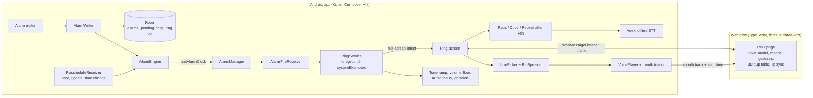

# RinAlarm

[](https://github.com/Earthkodyai/rin/actions/workflows/ci.yml)

An Android alarm clock where a 3D anime character, Rin, wakes you up. To stop the alarm you play a short game with her: copy her colour pattern, follow the ball under her cups, or repeat a sentence after her. Everything runs on the phone: no account, no ads, no internet permission.

Built solo as a portfolio project, from a university "make everyday life better" assignment. Kotlin and Jetpack Compose for the app, three.js and three-vrm in a WebView for Rin, Vosk for offline speech.

> **Status (1 October 2026):** v0.1, working on the developer's phone (Xiaomi 14T, HyperOS 2, Android 15). Not on Google Play yet. See [What is not done](#what-is-not-done) before trusting it with a real morning.

## The problem

Alarm clocks fail in two ways. Some fail to ring: Android phones from Xiaomi, Samsung and others kill background apps, delay alarms in battery saving, and hide full-screen alarms behind the lock screen. Others ring fine and get snoozed half asleep, because stopping them takes no thought at all.

Apps that fix the second problem usually do it with punishment: math puzzles, photos of the sink, walking around the room. Research on self-control tools says strict tools get abandoned (decision record [ADR 0002](docs/adr/0002-no-wake-up-check.md)).

## The approach

- **Reliability first.** The alarm engine was proven on the phone before any character work (spike S1), and every ring is logged so failures show up in the app's Diagnostics screen instead of in a missed morning.
- **A game, not a chore.** Stopping the alarm takes about 20 to 60 seconds of light attention with Rin, played from bed. Out-of-bed missions (walk, QR sticker, photo of an object) were built, measured and dropped ([ADR 0001](docs/adr/0001-games-replace-out-of-bed-missions.md)).
- **A companion that stays small.** Rin speaks one way, from about 190 pre-recorded lines. No chat, no streaks, no relationship level, nothing carried from one morning to the next ([ADR 0003](docs/adr/0003-one-way-voice.md), [ADR 0004](docs/adr/0004-no-cross-day-state.md)).
- **Offline by design.** The app has no internet permission at all, and the build checks it ([privacy notice](https://earthkodyai.github.io/rin/privacy/)).

## A morning with Rin

1. The alarm rings over the lock screen. Rin greets you in a mood that fits the hour, and the tone ducks while she talks.
2. Tap **Let's play**. Rin picks today's game, or the alarm has a fixed one:
   - **Colour pads:** Rin's hand taps a pattern on four coloured pads (3, then 4, then 5 moves). Repeat it.
   - **Cup shuffle:** she hides a ball under one of three cups and shuffles them with her hands. Pick the right cup three times in a row.
   - **Repeat after Rin:** she says a short sentence; say it back. Speech recognition runs on the phone, and tapping the words is always a fallback.
3. During a game she only speaks after a mistake. When you win she praises you, says one closing line about the day, and the alarm is off.

Snooze (5 minutes, up to 3 times) and an emergency hold-to-stop are always there. Rest day and sick day buttons on the home screen make the next alarm game-free and gentle, and a No pouting setting keeps Rin calm.

## Architecture



- **The ring path never waits on anything optional.** Everything the ring needs travels in its intent; the database, Rin's page and the voice clips are all allowed to fail, and the alarm still rings with a plain Dismiss button.
- **Rin is a web page in a WebView**, loaded only from the app's own assets through `WebViewAssetLoader`. Native code drives her through a typed JSON bridge restricted to that origin. Voice plays natively, so a crashed renderer leaves a still image, not silence.
- **Pure rules, tested without a phone.** Ring policy, mission planning, line picking, setup checks and the games' state machines are plain Kotlin objects with unit tests. The Android parts are thin adapters around them.

Code map: `app/src/main/java/.../alarm` (engine, ring service, receivers), `mission` (games), `dialogue` (script and line picking), `character` (WebView host, voice), `ui` (screens), `web/character` (Rin's page), `tools` (model, voice and measurement scripts), `docs` (plan, decisions, spike reports).

## Engineering challenges

- **Alarms that ring on an OEM phone.** HyperOS blocks `adb` shortcuts, kills apps, and needs a vendor-only "Show on Lock screen" permission on top of Android's. The ring runs as a `systemExempted` foreground service started by `setAlarmClock`, re-arms after boot (including before the first unlock, through Direct Boot), and retries refused audio focus. Diagnostics checks every permission the ring depends on and explains each fix.
- **A permission that turns itself off.** On the test phone, HyperOS reset the full-screen alarm permission on every app update (four times out of four), so the next alarm only made a sound. The app now shows a red banner and posts one notification after an update when this happens ([ADR 0006](docs/adr/0006-full-screen-permission-is-critical.md)).
- **60 fps 3D in a WebView.** The first VRoid model used 620 to 720 MB of memory. KTX2 texture compression brought it to about 490 MB, and the ring screen holds 60 fps while the home strip is capped at 30 to save battery. A WebGL WebView placed directly in Compose froze after load on the test phone; hosting it in a FrameLayout fixed it.
- **Speech that has to work on a sleepy, accented voice.** Free spoken answers reached only 77% for the Thai tester (spike S3), so the game asks for one known sentence and Vosk only listens for the words on screen. Every threshold was frozen on a development set before a held-out set was recorded.
- **Lip sync without a server.** Each clip ships with a precomputed mouth track (loudness plus vowel shapes), timed from the audio's presentation timestamp. Vowel shapes passed 18 of 20 held-out words before they were switched on.
- **Measuring privacy, not just claiming it.** The app has no internet permission, yet an overnight battery dump showed about 29 KB charged to it. The sockets belonged to Google Play services: WebView's Safe Browsing looked Rin's page up on every app open. It is turned off now, and a cold start measures 0 bytes. A unit test ties each privacy claim to the manifest.

## Measured results

All on the Xiaomi 14T unless noted. Methods and raw logs are in [`docs/spikes`](docs/spikes).

| What | Result |
|---|---|
| Alarm timing (spike S1: reboot, Doze, battery saver, app killed and more) | Fired in every tested case, at most 850 ms late; sound within 1.8 s |
| Rin's page load (sample VRoid model) | First frame in 1.1 to 1.5 s (1.9 s on the first launch after install) |
| Rendering | 60 fps on the ring screen; home strip at its 30 fps cap with no frame over 50 ms |
| Mood change on screen | 20 of 20 within 300 ms (median 217 ms) |
| Colour pads, held-out rings | 10 of 10 passed (20 to 38 s) |
| Cup shuffle, held-out rings | 6 of 6 passed (stopped early; the other 4 are not scored) |
| Repeat after Rin, held-out rings | 10 of 10 passed by voice, 0 false accepts (0/16 recorded, 0/160 synthetic) |
| Simulated full run (spike 3.7) | 10 of 10 scenarios passed |
| Whole morning with no network | Passed, every voice line from the phone |
| Battery, one night on battery (9.5 h, one real 07:00 alarm) | 9.1 mAh of 633 mAh used by the phone (1.4%) |
| Network traffic per app open | 0 bytes (was about 7 KB before Safe Browsing was turned off) |
| Unit tests | 342, plus instrumented receiver and UI tests on an emulator in CI |

## What is not done

This is a v0.1 built against a deadline ([ADR 0005](docs/adr/0005-finish-by-deadline.md)). Everything below was deferred or failed a bar, and is listed rather than hidden.

- **Not on Google Play.** Phase 8 needs a developer account and a closed test with 12 people for 14 days.
- **No testers besides the developer.** Limited distribution waits for the developer's own Rin model, because the sample model's licence forbids redistribution (below).
- **The 14-night real-world alarm run has not started.** Reliability rests on spike S1, the simulated run and one real morning.
- **One phone, one speaker.** Everything was measured on one Xiaomi 14T and one tester's voice. Repeat after Rin reached 75% on the recorded held-out set against an 80% bar; 2 or 3 other speakers should record it.
- **Untested:** an incoming call during a ring, overnight Doze with the latest build, a time-zone change, dark-room rings for the cup and speech games.
- **The full-screen permission after a Play Store update** may or may not reset the way it does after an `adb` install.
- **UI and theme** are functional, not designed. A UI/UX phase is planned before Play.

## Build it

Requirements: JDK 17, Android SDK 37, Node 24.

```bash
./gradlew assembleDebug
```

A clone builds and runs without Rin's model or voice: she shows as a silhouette and her lines appear as subtitles. Optional keys in `local.properties`, all pointing outside the repo:

| Key | Purpose |
|---|---|
| `rin.model` | A VRM model; the build compresses it with KTX2 |
| `rin.voice` | The voice pack built by `tools/voice/pack.mjs` |
| `rin.signing` | `keystore.properties` for a signed release build |

Tests: `./gradlew testDebugUnitTest` (unit), `./gradlew connectedDebugAndroidTest` (instrumented; note that it force-stops the app, which clears its alarms until the app is opened again).

## Privacy

RinAlarm keeps alarms, settings and a ring log on the phone, uses the microphone only while Repeat after Rin listens, and sends nothing anywhere. Full notice in [English](https://earthkodyai.github.io/rin/privacy/) and [Thai](https://earthkodyai.github.io/rin/privacy/th/), also inside the app.

## Decisions and plan

- Architecture decision records: [`docs/adr`](docs/adr)
- All 26 plan decisions, alternatives not taken, and spike results: [`docs/plan/01-decisions.md`](docs/plan/01-decisions.md) (Thai)
- Threat model: [`docs/plan/09-security-privacy.md`](docs/plan/09-security-privacy.md) (Thai)

## Credits and licences

- Code: [MIT](LICENSE).
- The demo model is **AvatarSample_O © pixiv VRoid Project**, used on the developer's phone only under its personal, non-profit terms. It is not in this repository and is never distributed.
- Rin's voice was generated with ElevenLabs during a paid plan, which allows commercial use. The clips are not in this repository.
- [three.js](https://threejs.org) and [three-vrm](https://github.com/pixiv/three-vrm) (MIT), [Vosk](https://alphacephei.com/vosk/) and its small English model (Apache 2.0), Google ML Kit barcode scanning, AndroidX and Jetpack Compose (Apache 2.0).
