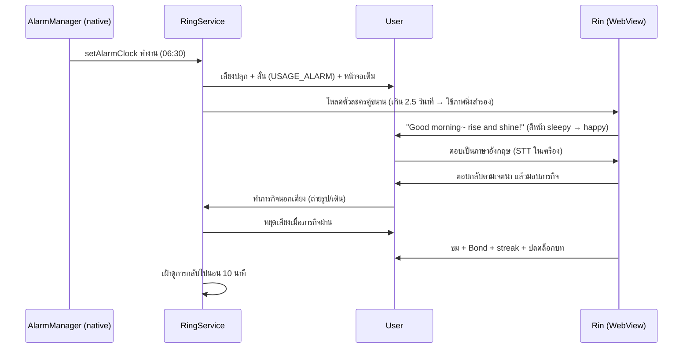

# 4. ประสบการณ์หนึ่งเช้า (Morning flow)

```mermaid
sequenceDiagram
  participant A as AlarmManager (native)
  participant S as RingService
  participant U as User
  participant R as Rin (WebView)
  A->>S: setAlarmClock ทำงาน (06:30)
  S->>U: เสียงปลุก + สั่น (USAGE_ALARM) + หน้าจอเต็ม
  S->>R: โหลดตัวละครคู่ขนาน (เกิน 2.5 วินาที → ใช้ภาพนิ่งสำรอง)
  R->>U: "Good morning~ rise and shine!" (สีหน้า sleepy → happy)
  U->>R: ตอบเป็นภาษาอังกฤษ (STT ในเครื่อง)
  R->>U: ตอบกลับตามเจตนา แล้วมอบภารกิจ
  U->>S: ทำภารกิจนอกเตียง (ถ่ายรูป/เดิน)
  S->>U: หยุดเสียงเมื่อภารกิจผ่าน
  R->>U: ชม + Bond + streak + ปลดล็อกบท
  S->>S: เฝ้าดูการกลับไปนอน 10 นาที
```

กติกา snooze: รินยอมให้ 1 ครั้ง ("Five more minutes… just this once!") ถ้ากดครั้งที่ 2 รินจะเริ่มงอน (ตั้งค่าได้)
