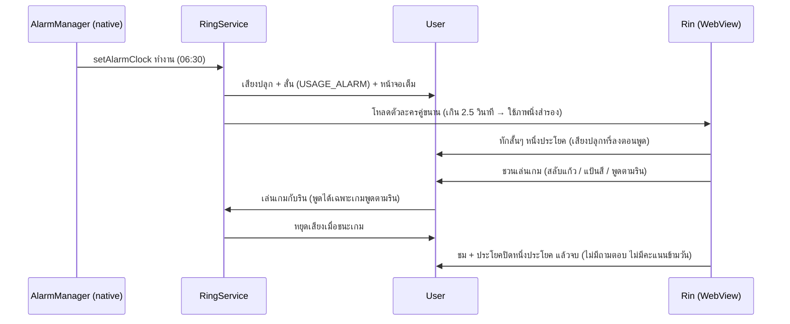

# 4. ประสบการณ์หนึ่งเช้า (Morning flow)

หลังปิดปลุกแอปไม่ทำอะไรต่อ ไม่มี wake-up check หรือการเฝ้าดูการกลับไปนอน (D18, [ADR 0002](../adr/0002-no-wake-up-check.md)) · แผนภาพปรับตาม D17 (เกม 3 เกม), D21 (รินพูดทางเดียว) และ D22 (ทุกเช้าเริ่มใหม่)

กติกา snooze: รินยอมให้ 1 ครั้ง ("Five more minutes… just this once!") ถ้ากดครั้งที่ 2 รินจะเริ่มงอน (ตั้งค่าได้)
