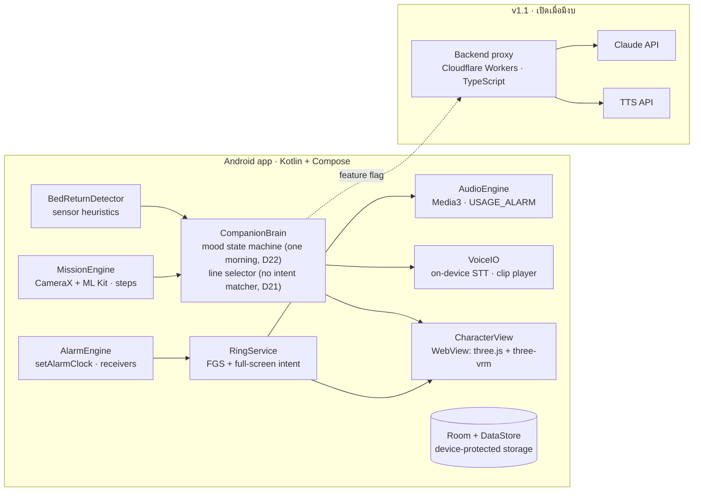

# 5. สถาปัตยกรรม

## 5.1 หลักการที่ห้ามละเมิด
1. **เส้นทางการปลุกเป็น native ล้วน**: `setAlarmClock` → foreground service → เสียงแบบ `USAGE_ALARM` ต้องไม่พึ่งเน็ต WebView หรือ AI เลย ส่วนอื่นเป็นของเสริมที่พังได้โดยไม่กระทบการปลุก
2. **Offline-first**: ทุกฟีเจอร์ AI ต้องมีทางสำรองแบบออฟไลน์ที่ผู้ใช้แทบไม่รู้สึกว่ามีการสลับ
3. **AI เลือก ไม่ได้สร้าง**: LLM ตอบกลับเป็น JSON ว่าจะพูดอะไร ใช้อารมณ์ไหน และท่าทางไหน จากรายการที่กำหนดไว้ แอปเป็นคนเล่นแอนิเมชันเอง
4. **ข้อมูลอ่อนไหวอยู่ในเครื่อง**: รูปภาพและเสียงไม่ออกจากเครื่อง (v1.1 ส่งออกเฉพาะข้อความ)
